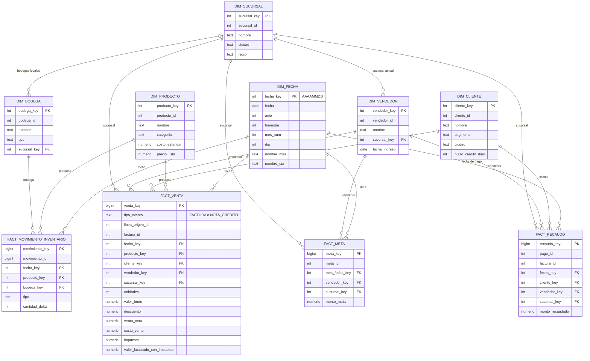

# Diagrama del modelo para análisis

Modelo en constelación: 4 tablas de hechos que comparten 6 dimensiones.
La imagen `diagrama_estrella.png` es el mismo diagrama.

```mermaid
erDiagram
    DIM_FECHA ||--o{ FACT_VENTA : "fecha"
    DIM_PRODUCTO ||--o{ FACT_VENTA : "producto"
    DIM_CLIENTE ||--o{ FACT_VENTA : "cliente"
    DIM_VENDEDOR ||--o{ FACT_VENTA : "vendedor"
    DIM_SUCURSAL ||--o{ FACT_VENTA : "sucursal"
    DIM_FECHA ||--o{ FACT_MOVIMIENTO_INVENTARIO : "fecha"
    DIM_PRODUCTO ||--o{ FACT_MOVIMIENTO_INVENTARIO : "producto"
    DIM_BODEGA ||--o{ FACT_MOVIMIENTO_INVENTARIO : "bodega"
    DIM_FECHA ||--o{ FACT_META : "mes"
    DIM_VENDEDOR ||--o{ FACT_META : "vendedor"
    DIM_SUCURSAL ||--o{ FACT_META : "sucursal"
    DIM_FECHA ||--o{ FACT_RECAUDO : "fecha de pago"
    DIM_CLIENTE ||--o{ FACT_RECAUDO : "cliente"
    DIM_VENDEDOR ||--o{ FACT_RECAUDO : "vendedor"
    DIM_SUCURSAL ||--o{ FACT_RECAUDO : "sucursal"
    DIM_SUCURSAL |o--o{ DIM_BODEGA : "bodegas locales"
    DIM_SUCURSAL ||--o{ DIM_VENDEDOR : "sucursal actual"

    FACT_VENTA {
        bigint venta_key PK
        text tipo_evento "FACTURA o NOTA_CREDITO"
        int linea_origen_id
        int factura_id
        int fecha_key FK
        int producto_key FK
        int cliente_key FK
        int vendedor_key FK
        int sucursal_key FK
        int unidades
        numeric valor_bruto
        numeric descuento
        numeric venta_neta
        numeric costo_venta
        numeric impuesto
        numeric valor_facturado_con_impuesto
    }
    FACT_MOVIMIENTO_INVENTARIO {
        bigint movimiento_key PK
        bigint movimiento_id
        int fecha_key FK
        int producto_key FK
        int bodega_key FK
        text tipo
        int cantidad_delta
    }
    FACT_META {
        bigint meta_key PK
        int meta_id
        int mes_fecha_key FK
        int vendedor_key FK
        int sucursal_key FK
        numeric monto_meta
    }
    FACT_RECAUDO {
        bigint recaudo_key PK
        int pago_id
        int factura_id
        int fecha_key FK
        int cliente_key FK
        int vendedor_key FK
        int sucursal_key FK
        numeric monto_recaudado
    }
    DIM_FECHA {
        int fecha_key PK "AAAAMMDD"
        date fecha
        int anio
        int trimestre
        int mes_num
        int dia
        text nombre_mes
        text nombre_dia
    }
    DIM_PRODUCTO {
        int producto_key PK
        int producto_id
        text nombre
        text categoria
        numeric costo_estandar
        numeric precio_lista
    }
    DIM_CLIENTE {
        int cliente_key PK
        int cliente_id
        text nombre
        text segmento
        text ciudad
        int plazo_credito_dias
    }
    DIM_VENDEDOR {
        int vendedor_key PK
        int vendedor_id
        text nombre
        int sucursal_key FK
        date fecha_ingreso
    }
    DIM_SUCURSAL {
        int sucursal_key PK
        int sucursal_id
        text nombre
        text ciudad
        text region
    }
    DIM_BODEGA {
        int bodega_key PK
        int bodega_id
        text nombre
        text tipo
        int sucursal_key FK
    }
```
